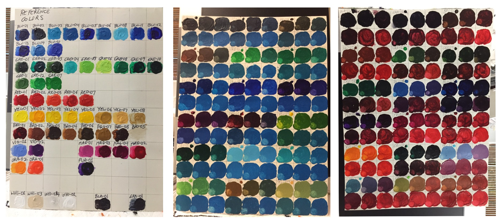

## About: The Reference Data and Match Methodology
 
 This App grew out of my interest in [painting](https://deqi4muztfq55.cloudfront.net/paintings--drawings.html). Its purpose is to suggest acrylics paint colors associated with selected areas of a photo and it does this by applying a selected _Match Method_ against a database of reference paints, paint mixes, and generic paint references.

### The Reference Data

The Paints Database is currently comprised of over 2,400 paint references and mixes each of them created manually (screenshots below show three sample sheets). For accuracy, 1 ml syringes were used to measure/dispense the paints and cotton swabs to carefully mix them (for this version, only two-color mixes were created though the App functionally supports using a "mix" as reference for a three-way or multi-color mix)

The paint was applied on acid-free, triple-primed white canvas paper in generally thick layers or _Thick_ as set in the "Canvas Coverage" property. Paint coverage might also be specified as _Medium_, _Thin_ or _Sparse_ (these latter three categories usually the result of using less paint and/or transparent or translucent paints)

After the paint swatches sheets were created they were photographed. For lighting consistency, this was done with pre-dominantly artificial light, at the same time of day for each sheet, and in a way that eliminated reflection as much as possible (the photographic techniques did not involve any form of calibration or optical spectrometry). Photographed swatches were then entered manually using the app _Mix Association_ (currently not enabled) feature and the individual properties of each swatch set in the App _Color Detail_ View (an example data capture session is shown __[here](DataCapture.md)__)

### The Match Methodology

The user may apply up to seven _Match Methods_ or algorithms to find one or more potential matches. Each method compares the tap area against the database of paints to yield a difference (d). The smaller the _d_ value the better the match is assumed to be. The computations, based on [___RGB___](https://en.m.wikipedia.org/wiki/RGB_color_space) and/or [___HSB___](https://en.m.wikipedia.org/wiki/HSL_and_HSV) color properties, are shown below:

* RGB only or default:

   _d = sqrt((r2-r1)^2 + (g2-g1)^2 + (b2-b1)^2)_

* HSB only:

   _d = sqrt((h2-h1)^2 + (s2-s1)^2 + (b2-b1)^2)_

* RGB and Hue:

   _d = sqrt((r2-r1)^2 + (g2-g1)^2 + (b2-b1)^2 + (h2-h1)^2)_

* RGB + HSB:

   _d = sqrt((r2-r1)^2 + (g2-g1)^2 + (b2-b1)^2 + (h2-h1)^2 + (s2-s1)^2 + (b2-b1)^2)_

* Weighted RGB:

   _d = ((r2-r1)*0.30)^2 + ((g2-g1)*0.59)^2 + ((b2-b1)*0.11)^2_

* Weighted RGB + HSB:

   _d = ((r2-r1)*0.30)^2 + ((g2-g1)*0.59)^2 + ((b2-b1)*0.11)^2 + (h2-h1)^2 + (s2-s1)^2 + (b2-b1)^2_

* Hue only:

   _d = sqrt((h2-h1)^2)_

I found that though some of these methods (in particular the RGB only one) tend to produce the best results while others might perform slightly better at different RGB/HSB ranges. All methods do consistently produce better results matching darker colors than lighter ones so I am working on improvements to the accuracy, in particular, relating to lighter values.

### Why Not _Derive_ Paint Mixes?

In the [_Additive_](https://en.m.wikipedia.org/wiki/Additive_color) Color Model (i.e., computer screens) the resulting color can be easily derived from overlapping RGB values. Paint Mixes, on the other hand, are created based on the [_Subtractive_](https://en.m.wikipedia.org/wiki/Subtractive_color) Color Model in which the derived color is the result of the selective absorption of wavelengths of light (thus the combined spectrum wavelengths that are reflected render the true paint color). It is because of the absorption/reflection of pigments that the RGB value of paint mixes cannot be derived by simple addition. My hope is to attempt to implement a derivation method covering at least a subset of the data. This is still a work in progress and slated for a future release.

### Filling in the Gaps

There are currently about 2,800 paint colors (including type _GenericPaint_) captured yet the RGB color space has 16,777,216 combinations. Though that number is significantly smaller when taking into account human perception, those _perceived gaps_ still remain. The App still provides, in many cases, if not a reasonably accurate suggestion at least a starting point that may help the user achieve a closer match through further mixing. The App also allows users to capture and catalog their own mixes (not enabled for this version), search the data and more importantly, create an indexed, searchable database of topic associations or keep track of their favorite colors (see [_Image Area(s) Match_](https://spineo.github.io/RGButterflyDocs/ImageMatch.html)).

___Generic___ is a type of swatch that has been captured to help fill in these gaps. This category is not tied to a specific Paint Brand but is rather a generically _Named_ color tied to RGB (and [_Hex_](https://en.m.wikipedia.org/wiki/Web_colors)) values. While this category does not provide information about the Paints it might provide, in the absence of close paint matches, information about where in a [_Color Wheel_](https://en.m.wikipedia.org/wiki/Color_wheel) the reference area might fall.

 For questions/comments about this App please email me at [svpineo@gmail.com](mailto:svpineo@gmail.com)

