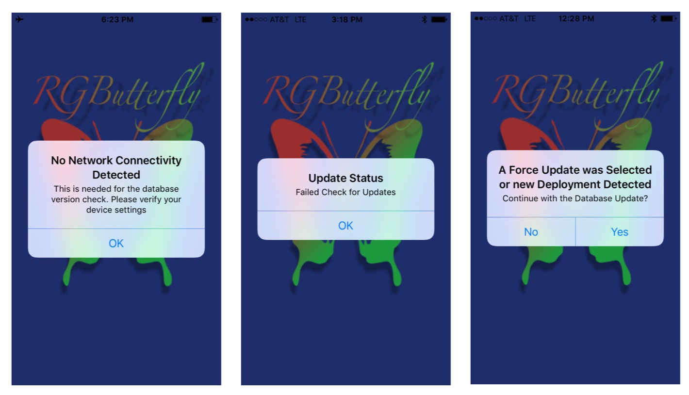

## Privacy, Access and Alerts

 This section briefly discusses Privacy, Access and Alerts

### Privacy

The RGButterfly App does not store user or location information.

### Camera and Photo Library Access

To ensure access to the Camera or Photo Library by the RGButterfly App, Privacy Settings must be turned on (screenshot below). This option is usually provided in the form of an alert the first time user attempts to access these components.

### Initialization Alerts

As shown in the set of screenshots below, there are a number of Alerts that may come up during the App initialization.
* The _Network Connectivity_ alert (screenshot 1) is likely the result of the Phone _Airplane Mode_ turned on or no Cellular access. Internet connectivity is not required for this App since all the data is bundled directly within the App (it is only necessary if a database update is required/available or to access the Web documentation)

* The _Failed Updates_ alert (screenshot 2) results from the Database Update REST API being inaccessible. This alert will not affect existing functionality unless a database update or restore is required (i.e., as a result of accidentally deleting needed data). In the interim, an iCloud backup of the App may be needed to restore the correct snapshot.

* The _Force Update/New Deployment_ alert (screenshot 3) occurs when a new update to the database is available or when the user has enabled _Force Update_ in the _RGButterfly Settings_ (usually done when a restore is required). If _Yes_ is selected, the update process may spawn additional alerts depending on whether the outcome is successful or not.

### Validation and Informational Alerts

A number of validation and informational alerts may pop up while using the App.

* _Validation_ alerts typically occur when incorrect data is entered (i.e., text entered in a field exceeds allowable length)

* _Informational_alerts_ are enabled by default and help first-time users navigate the features. These alerts can be turned off on a case-by-case basis or globally in _RGButterfly Settings_.
