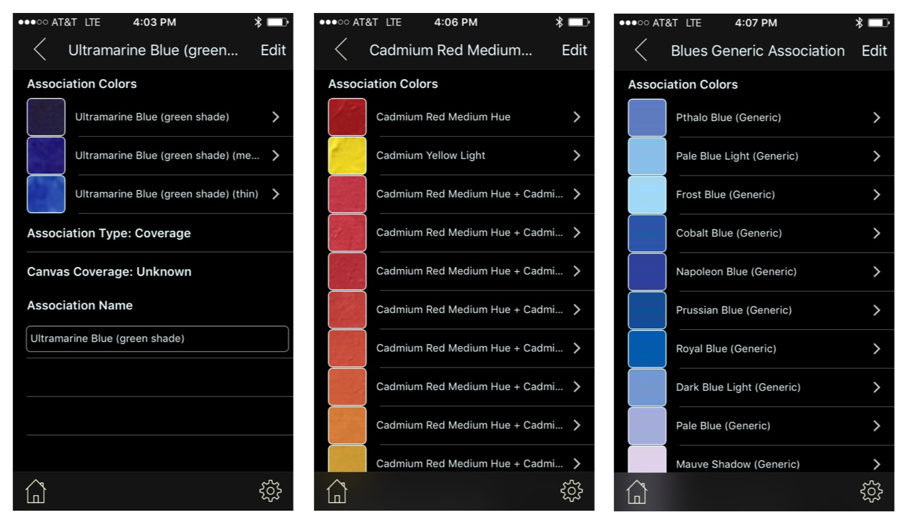

## Association Types
 
 There are three types of associations created through the manual or bulk [__data capture__](DataCapture.md) methods:

* ___Coverage___ associations, as shown in the first screenshot below, are related paint _references_ with varying HSB/RGB values, each the result of a different paint application thickness (i.e., in a _thin_ application, to the degree that the underlying canvas shows through, will yield different values than a _thick_ application that fully blocks the canvas)

* ___Mix___ associations (screenshot 2) are produced by mixing two _reference_ paints (first two rows). Each resulting mix (remaining rows) captures a unique blend or _mix ratio_ of the reference paints.

* ___Generic___ associations (final screenshot) are collections of _named_ swatches that are not associated with specific paint references or mixes. They are used as "fillers" during the matching process to identify a color by name in the absence of close paint matches. While most Generic associations use a _Color Wheel_ categorization, other rules have also been used for the assocation.

These assocations are implemented as collection views with no size limitations. Some are as small as 2 (typically Coverage assocations) or may contain well over 100 items as is the case with a few of the Generic assocations.

