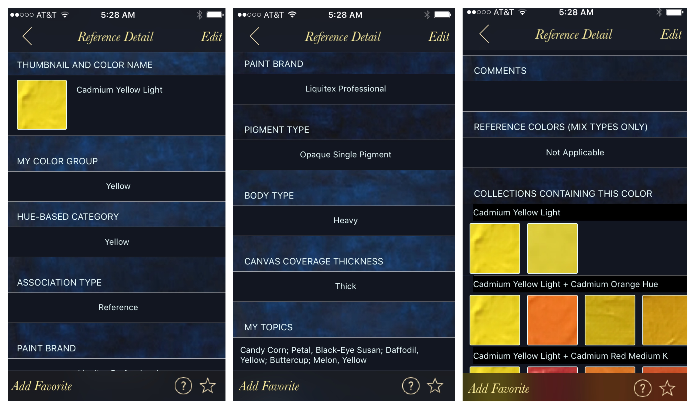

## Color Detail Views
 
 The screenshots below show a  Reference type detailed view example in _Non-Edit_ mode (in _Edit_ mode, text fields/views become editable and Picker views selectable though current release contains a limited number of fields that are user-editable). The _MixAssoc_, _Generic_, and _GenericPaint_ type views contain the same fields but a subset of the data.

The __Reference Detail__ fields include:
* Thumbnail and Color Name (clicking on the thumbnail enlarges it)
* My Color Group (selectable in this version)
* Hue-Based Category (derived label)
* Association Type (selection, others included the MixAssoc, Generic, and GenericPaint)
* Paint Brand (selection or 'Other' which allows user text input)
* Pigment Type (selection)
* Body Type (selection, generally 'Heavy' as indicated in the Paint Brand label)
* Canvas Coverage Thickness (selection and generally 'Thick' refering to the degree in which canvas shows through)
* My Topics (editable in this version) or keywords associated with this color (semi-colon separated if more than one)
* Comments (editable in this version)
* Reference Colors (only applicable to _MixAssoc_)
* Collections Containing this Color (_Reference_ colors typically contain multiple but not all shown below)

The __Add Favorite__ feature, new to this release, allows users to add this color to their _My Favorites_ listing (accessible by clicking the bottom right star button)

The __MixAssoc__ detail view contains only data applicable to the Mix as the reference data associated with each mix component has already been captured. The _Name_ field (usually auto-generated) contains the names of references that go into the mix plus the _mix ratio_ appended to the end.

The __Generic__ detail view contains similar content as the _MixAssoc_ view with the _Canvas Coverage_ and other paint-releated data missing as no paints are involved in creating these types of swatches. By convention, the name has the suffix '(Generic)'.

The __GenericPaint__ detail view contains similar content as the Generic one with the _Canvas Coverage_ field present as acrylic paints are the (second-hand) source for these colors. This types is also identified by the 'GenericPaint' _Association Type_ and the name suffix '(GP)' in the name.

