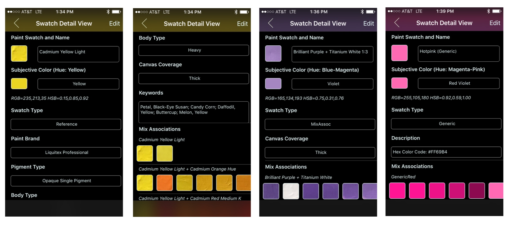

## Swatch Detail Views
 
 The screenshots below show the three different types of detailed views. The ___Reference___ detail view (screenshots 1 & 2) contains most of the information associated with a Paint Swatch including:

