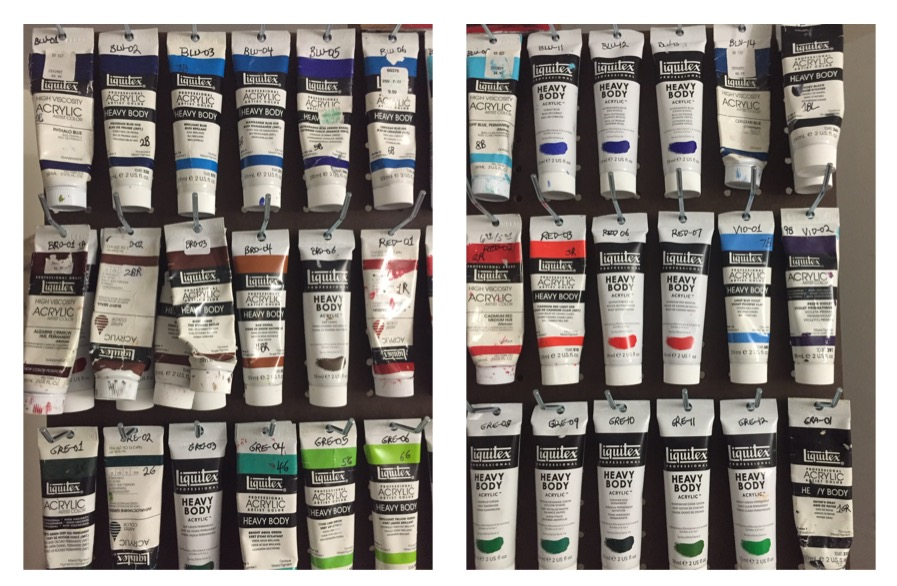

## Disclaimer
 
 

This app attempts to find matching paint references and/or mixes associated with a user selected area in a photo. It does this by applying a user selected algorithm based on the RGB and/or HSB color properties.  In many cases the heuristic misses the mark or is unable to find a suitable match against the database. My hope is to continue to improve that match rate with future releases as a result of both refinements in the algorithm and new paint references/mixes added to the database.

The results produced by this app are just guideliness that could be useful to the novice artist. While I have attempted to capture, as carefully as possible, the real colors of the reference paints and mixes, inaccuracies resulting from the paint mixing process and/or photographic lighting are likely to exist (see 'The Reference Data' in the 'About this App' section).

While most references are based on the Liquitex brand (see photo below) this does not mean I endorse that brand. Furthermore, no external entity has financed the development of this app. Reference colors or mixes linked to any brand may not accurately represent that brand due to potential shortcomings in the data capture methodologies.\n\n" Finally, this app grew out of my passion for art and programming. Since I am not a professional artist, photographer, or expert in color theory I had to first research and then implement (much through trial and error) the methods and algorithms used for this app. My hope is that this is just the first version of what might become a work in progress. I would like to hear from you on how I might improve it!

* Some of the Paints used for this project.
