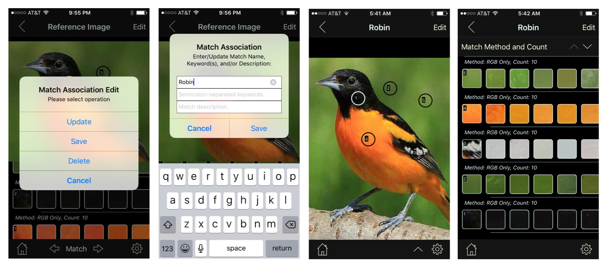
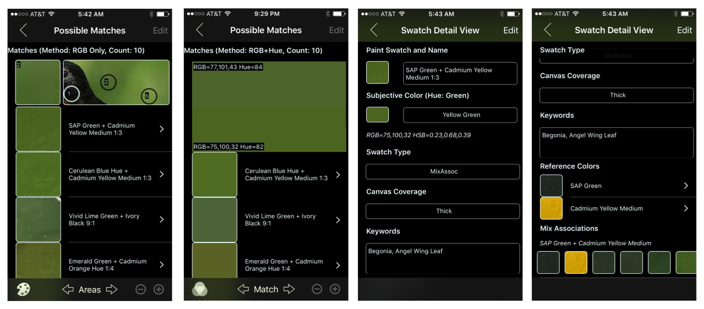
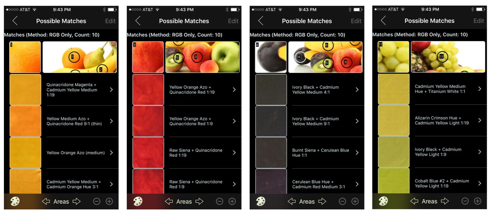

## Image Match Examples

 The set of screenshots that follow show examples of the _Image Match_ functionality.

The first step is to integrate an image by navigating to the photo library or taking a new photo. This can be initiated by clicking on the _photo_ icon top-left of the Main View (screenshot 1 below). Once the image is picked it can be positioned in the _Match_ type (default) view of the _Image View_ (screenshots 2 & 3).

As shown in the final screenshot, single tapping on the image will create a numbered circle or square surrounding the tapped area and, along with it, a new row in the table area below the image. The left-most item in this row, corresponds to the tapped section thumbnail and the remaining items (scrollable right-to-left) the closest paint matches derived from applying a Match Algorithm (in this case the _RGB Only_ method). The default items _Count_ is configurable is the _Settings View_ and defaults to 10.

By moving the image around you can uncover areas not shown. To remove a tapped area simply tap on the image area you wish to remove and both tapped area and table entry disappear.

To view (or uncover) additional rows in the table scroll up or click on the _arrow up_ button described below.

_Note: The Match View does not support Landcape Orientation_

Clicking on the top-right _Edit_ button will generate an alert with a number of options (screenshot 1 below). Clicking on _Update_ will allow us to modify the generic name to "Robin" (for now, we will leave the keywords and description fields empty) and _Save_ will commit our changes (screenshot 2).

Notice that the display can be modified to _Image Only_ (arrow down button) or _Table Only_ (arrow up button) as shown in screenshots 3 & 4.

At this point we are ready look at some more detailed information about our matches. Clicking on one of the rows on the table (in our example we picked 2) will bring us to the _Possible Matches View_ (screenshot 1 below)

In this view the top row is stationary and contains the tap area thumbnail (left item) and the image larger section used for context (right item). The remaining scrollable rows represent the returned _Paint Swatches_ associated with the _Tapped Area_ in the order _Best Match Top_ as applied by the selected algorithm.

