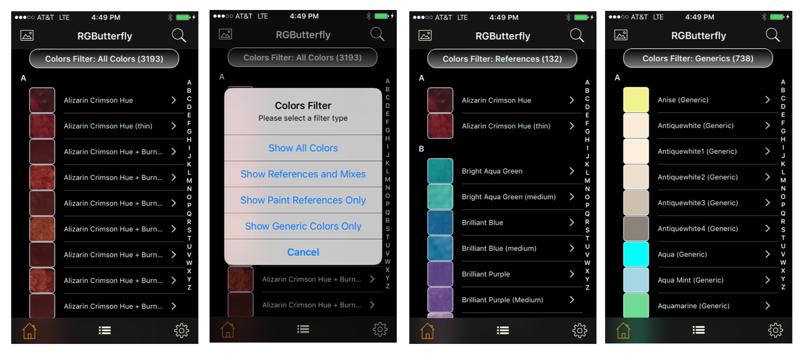

## Individual Listings
 
 In this view, the header button can be used to select from four types of filters (screenshots below). Filter _None_ (screenshot 1) list all colors and, as with all other filters, the aggregate count is displayed in parenthesis. The remaining filters are _References and Mixes_, _References_ only, and _Generics_ only. The top-right search button and/or letter index on the right can also be used to further refine the listings.

