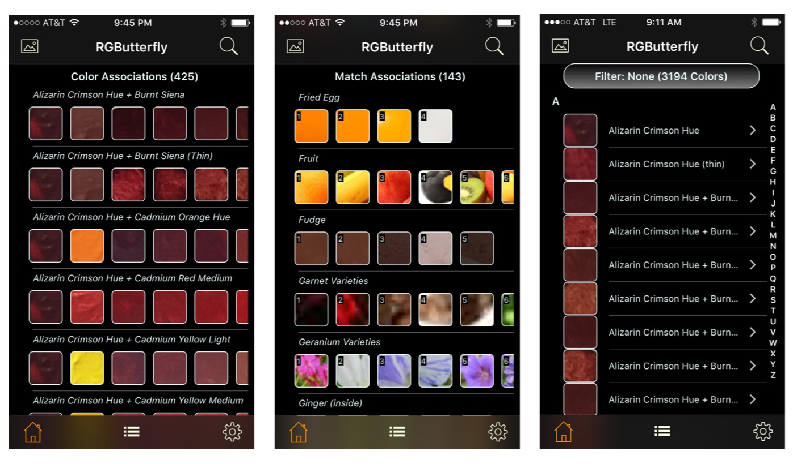
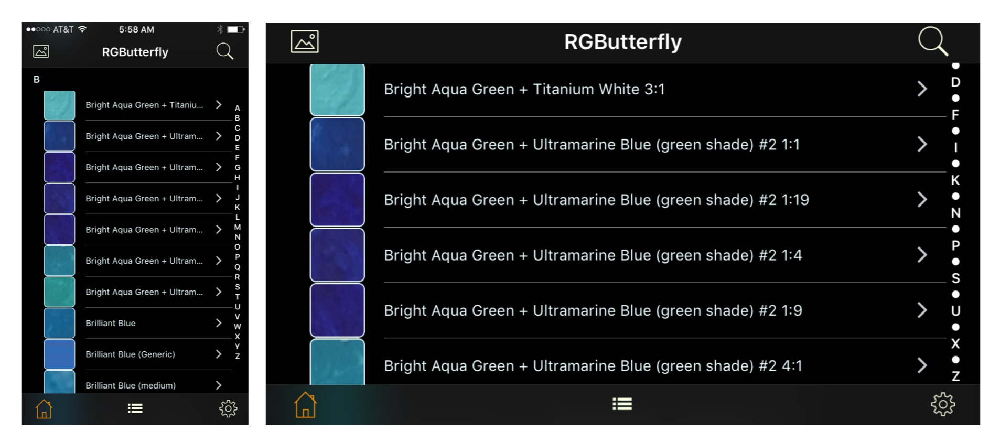
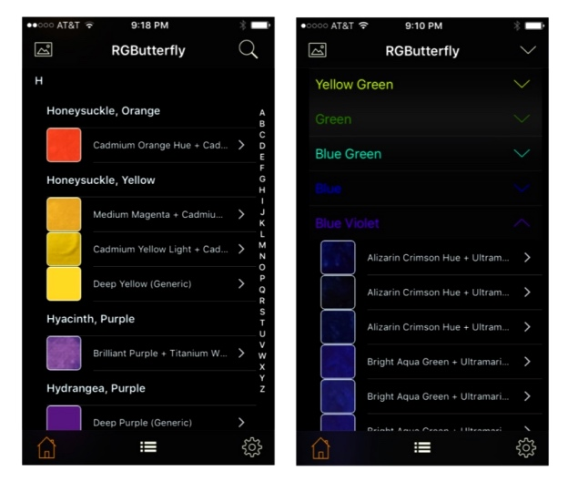
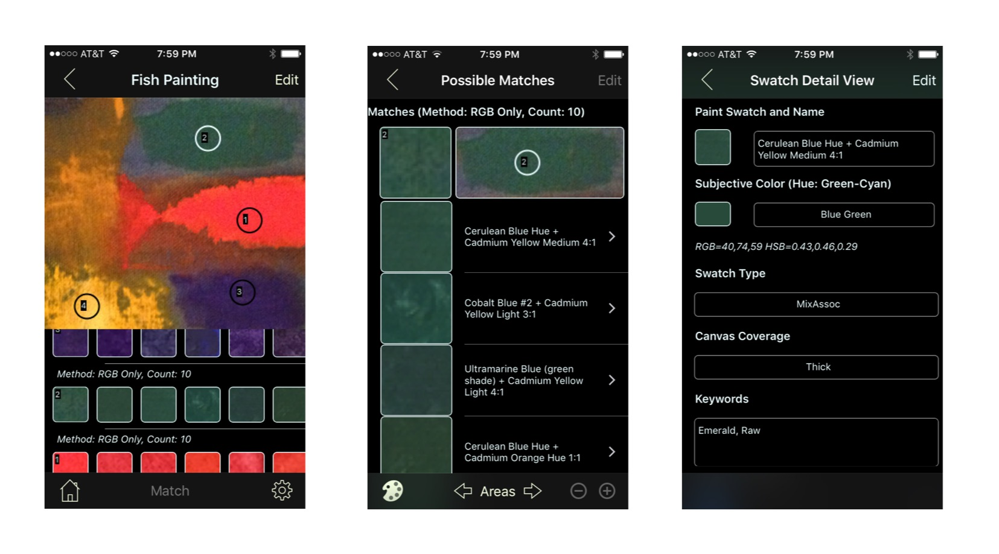
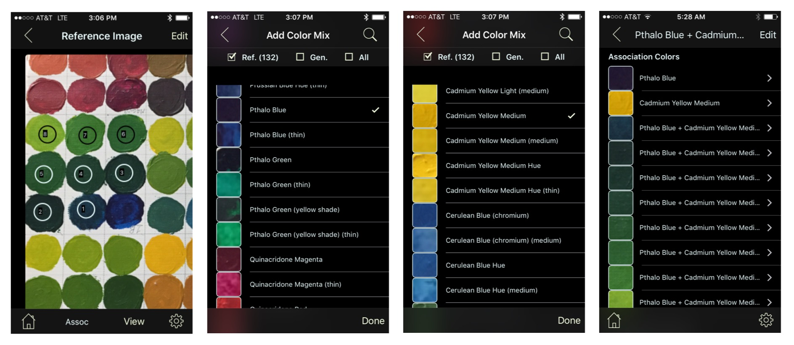
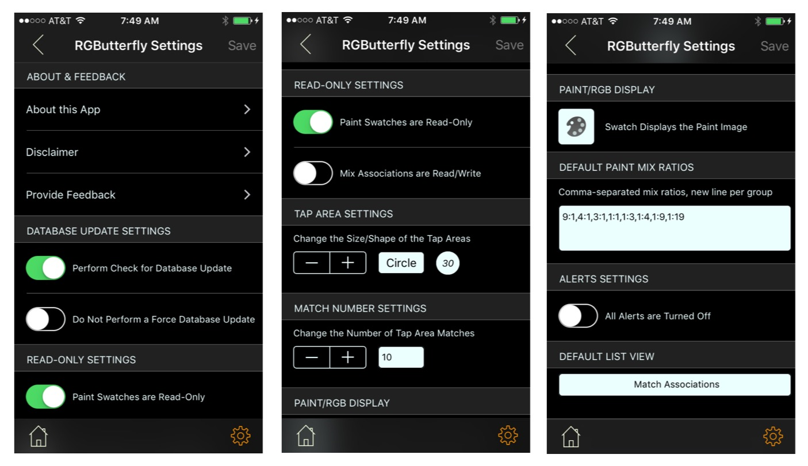

# RGButterflyDocs

## The [_RGButterfly_](http://rgbutterfly.com/) Paint App Documentation

 This main purpose of this experimental App is to help users find potential Acrylic color paint matches associated with tapped areas in a photo. It does this by applying a selected _Match Algorithm_ against a database of reference paints and paint mixes. More about the _Reference Data and Methodology_ can be found [__here__](About.md) and please read the _Disclaimer_ section [__here__](Disclaimer.md). The [___Programming Considerations___](Programming.md) section gives an overview of the program structure and development. ___Clicking on the RGButterfly logo will get you back to the main page___.

The three main tasks this App performs are ___Reference & Search___, ___Image Area(s) Match___ against a reference database, and the ___Paints Data Capture___.

### Reference & Search

The Initial View allows a user to switch between the five types of displays (shown in the screenshots that follow):
* __Color Associations__: An ordered list of collections each representing a _Mix, Coverage, or Generic Association_
* __Match Associations__: An ordered list of collections each representing a _Match Association_
* __Individual Colors__: An ordered list of individual colors (mainly reference and mix paint swatches)
* __Keywords Listing__: An alphabetized list of keywords and their associated reference or paint mixes
* __Subjective Colors__: A list of color categories and their associated reference or paint mixes

For each of the associations (first two screenshots below), scrolling right to left exposes remaining elements of the collection view (more on association can be found [__here__](Associations.md)). Clicking on any of the rows reveals detailed information about the selected association. For the [__Individual Colors__](Individual.md) listing (third screenshot), clicking on a row takes you directly to the [__detailed view__](Detail.md) for that _Mix_ or _Reference_ paint color.

Rotating to landcape, as shown below, makes it easier to read the full names. In the case of mixes, the longer display names include the two references and mix ratio.

The _Keywords Listing_ (first two screenshots below) allows users to search for keywords and associated references and/or mixes. The _Subjective Colors_ listing (third screenshot) categorizes colors into groups (similar to the _Color Wheel_). In this view, the elements of one or more groups can be revealed/hidden by clicking on the corresponding down/up arrow widgets (as shown below) or, alternatively, all groups can be revealed/hidden clicking on the arrow widget on the top Navigation Toolbar.

All listings, with the exception of _Subjective Colors_ are alphabetized and include the top-right magnifier __Search__ button (search rules are somewhat different for each type of listing). In addition, the _Individual Colors_ and _Keywords Listing_ also provide an __Alphabetical Index__ for quick access.

### Image Area(s) Match

A new photo can be taken or and existing image used for the Image Match. The screenshots below show the general sequence for this type of data capture. More detailed examples of this functionalithy can be found __[here](ImageMatch.md)__.

### Paints Data Capture

Photographed paint swatch areas can be tapped and integrated into a _Mix Association_ as shown in the screenshots below. The _Add Color Mix_ feature (screenshots 2 & 3) allows users to add existing reference colors to the mix. A more detailed session used for this type of data capture can be found __[here](DataCapture.md)__.

### Settings

The Settings Screen accessible from the gear button (bottom right on most views) allows a number of Global App Customizations including:
* Checks for Database Updates (which allows users to perform updates when available)
* Optionally setting Paint Swatches and/or Mix Associations to Read-Only for protection
* Changing the default shape (i.e., circle or rectangle) and size of a tap area
* Changing the number of tap area matches displayed
* Displaying Paint Swatches as captured or alternatively, rendered by RGB value
* Entering the _Mix Ratios Set(s)_ used for data capture
* Turning Off Informational Alerts
* Setting the default Initial View

The screenshots below capture the _Settings_ view

### Privacy, Access and Alerts

This App does not store user or location information. Specific privacy settings must be enabled in order to access the Camera or Photo Library. Alerts cover a variety of use cases (though most alerts are informational). More information on Access and Alerts can be found __[here](AccessAndAlerts.md)__.  

### Programming Considerations

[__This__](Programming.md) section gives an overview of the program structure and development process.

### Future Directions

Though App has not been released, there are a number of new features that I am looking to implement as well as existing ones that I plan to revisit sometime down the road. Some of the main ones include:

* ___Extend the Dataset___ by adding Paint/Keywords data
* Continue ___Improving the Match Algorithms___ and perhaps even look into data derivation formulas
* Consider __Deployment to Other Platforms and/or Device Types__
* Address __Internationalization/Localization__ issues
* __Improve Usability__ (covers things like improvements to the UI/Graphics and new User Settings, such as Fonts and Thumbnail sizes)
* ___Re-Enable Functionality___ such as _Match Association_ editing that will likely not be included in this release
* ___Revisit the Current Data Storage Model___ (perhaps consider centralized data storage and queries)

For questions/comments about this App please email me at [svpineo@gmail.com](mailto:svpineo@gmail.com)
