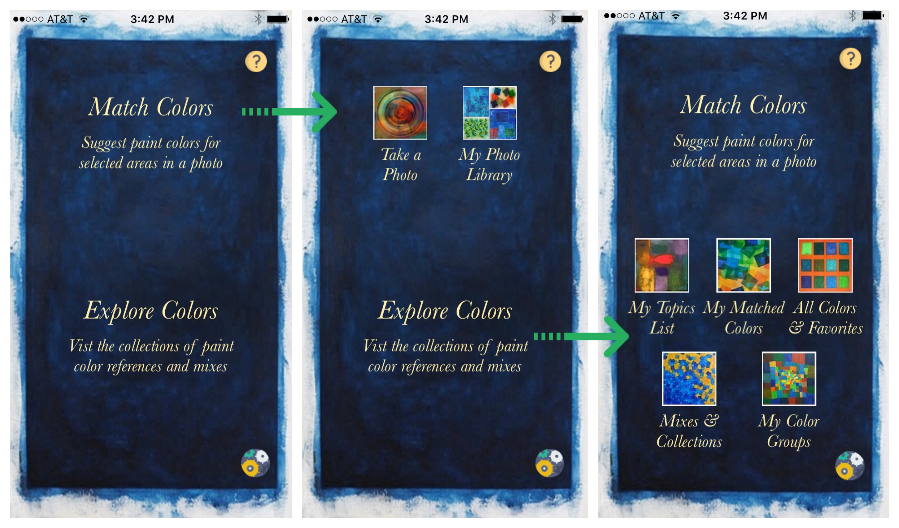
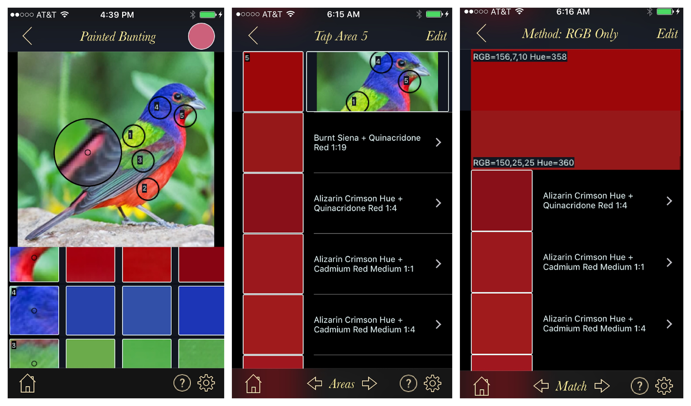

# [RGButterflyDocs](http://rgbutterfly.com/)

## Overview

 The main purpose of this App is to suggest matching paint colors for areas of a photo. To get started, click on either the ___Match Colors___ or ___Explore Colors___ titles or sub-labels on the main App view to display the action buttons (screenshots below). Note also the question mark button (top right) which displays the _About_ page and gear button (bottom right) which takes you to the _Settings_ page. 

Please review the [__About__](About.md), [__Disclaimer__](Disclaimer.md), and [__Credits__](Credits.md) pages for more background information about the App. For easier use, this initial release comes with a number of features and much of the editing functionality disabled.

### Navigation, Help, Settings, and Edit Buttons

Most secondary views, like the ones shown below consistently display the following buttons:
* _Back Arrow_ (top left) gets you back to the previous view
* _Home Icon_ (bottom left) gets you back to the main view
* _Question Icon_ (bottom right) displays usage tips for that view
* _Gear Icon_ (bottom right gear) takes you to the _Settings_ page (more on this later)
* _Edit Text_ (top right) enables content editing where enabled

## Match Colors

As shown below, after an image is added (screenshot 1) user can perform the following actions:
* Tap on any area of the photo to create a _tap area_ (five are shown in this example). This will also automatically create a row in the table below displaying the tap area thumbnail and best matches.
* Tap on an existing tap area to remove it along with the table entry.
* Drag a tap area or just magnifiy an area of the photo to zero in on a color (perhaps a small area, as the example shows). Note also that the _RGB_ values are updated in the top-right circle during the drag and, of course, table updated when drag  completes.
* Dragged tap areas that would overlap an existing tap area get ignored (i.e., an overapping area needs to be first deleted or  perhaps more sensibly used instead!)
* Clicking on the _Edit_ button top-right (not shown here as it is masked by the color circle that appears when using the magnifier) allows you to rename, save, or delete the match. A match is also auto-saved and, if not explicitly  named, given a generic name that includes the date/time suffix.

Clicking on any of the table rows will present a detailed tabular view for that matched area (screenshot 2). The header (first row) shows the tap area thumbnail image rendered using its RGB values and, to the right, the relevant sub-section of the photo for context. The remaining rows show the suggested paint references and/or mix RGB rendered thumbnails and names. Note that tapping any of the arrows below will circle to the next or previous tap area. Tapping the _Areas_ button will switch to _Match_ mode and instead allow user to circle between the _Match Methods_ that can be applied to any tap area.

Finally, as shown in screenshot 3, pressing (not tapping!) any of the row names will color that full row as well as the top header with the RGB values allowing user to scroll and accurately compare swatches side-by-side. Note that tapping, instead of pressing, the row will take you to the detail view for that color.

## Explore Colors

Each action provides a different a different categorization of the close to 3,600 colors and access to saved _Matches_ and _Favorites_.

Please note: These modified docs are still a work in progress. For questions/comments about this App please email me at [svpineo@gmail.com](mailto:svpineo@gmail.com)

_Note: Clicking on this  logo will get you back to this main page_.
