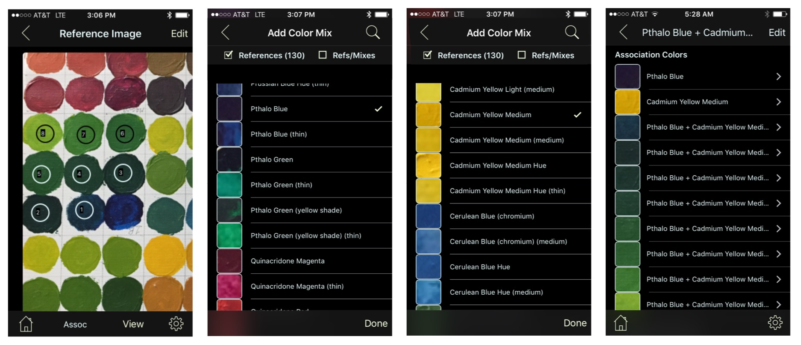

# RGButterflyDocs

## The [_RGButterfly_](https://spineo.github.io/RGButterflyDocs/) Paint App Documentation

 This experimental App aims to help users find potential acrylic color paint matches associated with selected areas of a photo. It does this by applying a selected _match algorithm_ against a database of reference paints and paint mixes. More about the reference data and methodology can be found __[here](About.md)__.

The three main tasks this App performs are _Reference & Search_, _Image Area(s) Match_ against a reference database, and the _Paints Data Capture_.

### Reference & Search

The Initial View allows a user to switch between the five types of displays (shown in the screenshots that follow):
* __Color Associations__: An ordered list of collections each representing a _Mix Association_
* __Match Associations__: An ordered list of collections each representing a _Match Association_
* __Individual Colors__: An ordered list of individual colors (mainly reference and mix paint swatches)
* __Keywords Listing__: An alphabetized list of keywords and their associated reference or paint mixes
* __Subjective Colors__: A list of color categories and their associated reference or paint mixes

For each association (first two screenshots below), scrolling right to left exposes remaining elements of the collection view. Clicking on any of the rows reveals detailed information about the selected association. For the _Individual Colors_ listing (third screenshot), clicking on a row takes you directly to the detailed view for that _mix_ or _reference_ paint.

Rotating to landcape, as shown below, makes it easier to read the full names. In the case of mixes, the longer display names include the two references and mix ratio.

The _Keywords Listing_ (first two screenshots below) allows users to search for keywords and associated references and/or mixes. The _Subjective Colors_ listing (third screenshot) exposes colors organized by group. In this view, the elements of one or more groups can be exposed by clicking on the corresponding collapse/uncollapse up/down arrow widget (as shown below) or, alternatively, all groups can be collapsed/uncollapsed clicking on the top arrow widget on the Navigation Toolbar.

All listings, with the exception of _Subjective Colors_ are alphabetized and include the top-right hourglass __Search__ (search rules vary with each listing). In addition, the _Individual Colors_ and _Keywords Listing_ also provide an __Alphabetical Index__ for quicker access.

### Image Area(s) Match

A new photo can be taken or and existing image used for the Image Match. Screenshots below show the general sequence for this type of data capture. More detailed examples of this functionalithy can be found __[here](ImageMatch.md)__.

### Paints Data Capture

Photographed paint swatch areas can be tapped and integrated into a _Mix Association_ as shown in the screenshots below. The _Add Color Mix_ feature allows users to add existing reference colors to the mix. A more detailed session used for this type of data capture can be found __[here](DataCapture.md)__.

### Settings

The Settings Screen accessible from the gear button (bottom right on most views) allows a number of App Customizations including:
* Checks for Database Updates (which allows users to perform updates when available)
* Optionally setting Paint Swatches and/or Mix Associations to Read-Only
* Changing the default shape (i.e., circle or rectangle) and size of a tap area
* Changing the number of tap area matches displayed
* Displaying Paint Swatches as captured or rendered by RGB value
* Entering the _Mix Ratios Set(s)_ used for data capture
* Turn Off Alerts
* Set the default Initial View

The screenshots below capture the _Settings_ view

