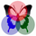

## Settings
 
 Global App customizations using the Settings controller include:

* Checks for Database Updates (which allows users to perform updates when available)
* Optionally setting Paint Swatches and/or Mix Associations to Read-Only for protection
* Changing the default shape (i.e., circle or rectangle) and size of a tap area
* Changing the number of tap area matches displayed and/or filtering certain swatches (i.e., Generics)
* Displaying Paint Swatches as captured or alternatively, rendered by RGB value
* Entering the _Mix Ratios Set(s)_ used for data capture
* Turning Off Informational Alerts
* Setting the default _Initial_ view

The 'Save' button (top right) is disabled unless any of the settings have been modified. An alert is also issued if, after making changes, user attempts to leave the controller without saving. The screenshots below capture the _Settings_ view.

A few other features included in this controller are the 'About this App' and 'Disclaimer' pages (both with links to the Web documentation), the 'Provide Feedback' link for sending an email, and the share button (bottom middle). This latter functionality (example screenshots shown below) allows the user to share the Web documentation via a selection of available Apps such as Email, Messenger, Twitter, and Facebook.

