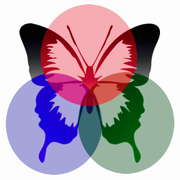
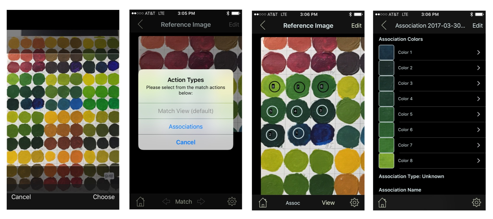
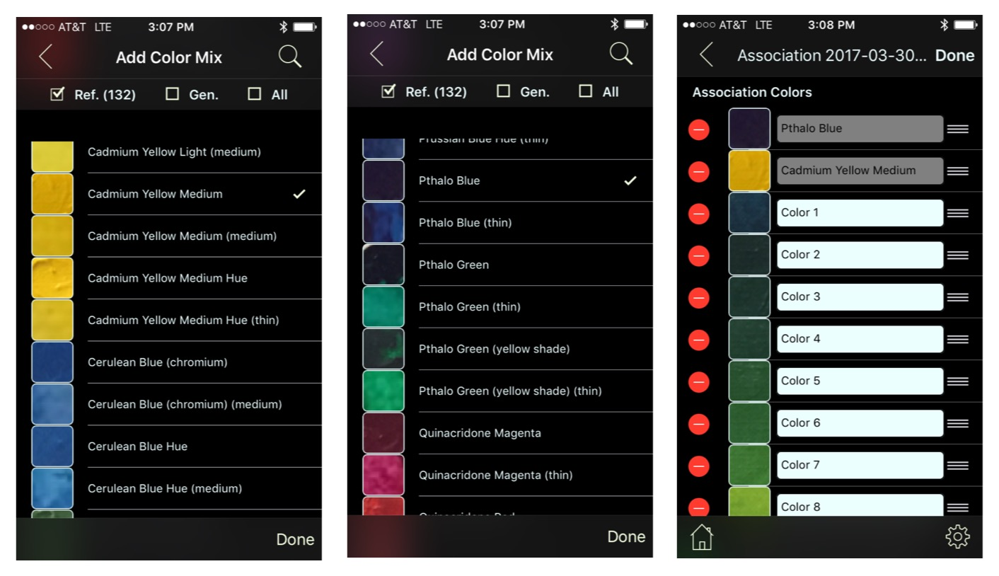
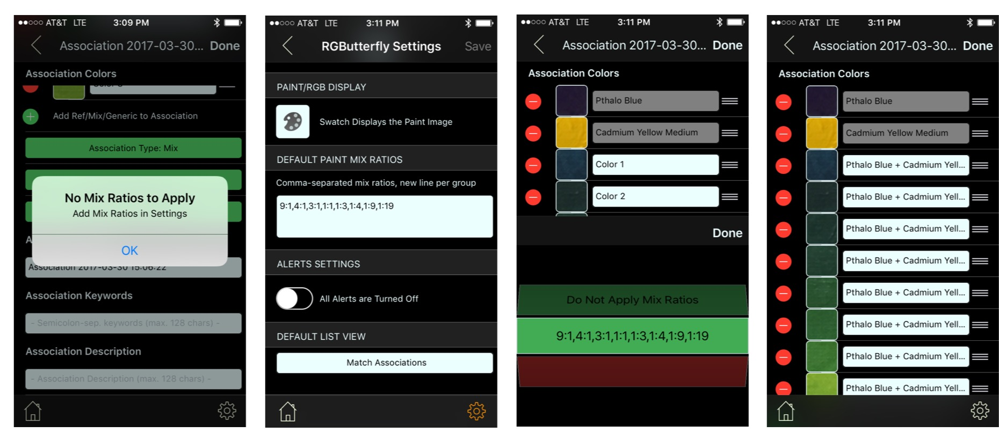

## Data Capture Session

 The next few sets of screenshots describe the manual data capture process in more detail. As shown in the figure below (left screenshot), the user selects or takes a photo of the desired paint swatches. Since this is a data capture we will change the Action Type to _Associations_ and tap each paint swatch that will be used to create our mix association (screenshots 2 & 3). Note that we did not tap on the swatch that is at the bottom right of the quadrant even though it is part of this association. That is because that reference color (Pthalo Blue) already exists in our database and will be integrated referentially. Likewise, the second reference color (Cadmium Yellow Medium), which is not shown, will also be integrated referentially.

Clicking on the _View_ (bottom toolbar, right hand side) will display the selected colors in a table with their assigned generic name.

Clicking the _Edit_ button (top right) in our Mix Association view gives us the option of adding the reference colors (first two screenshots below) mentioned earlier by tapping the '+' green button. In this mode (third screenshot) we are also able to modify the color order, remove elements, or edit the new color names (with the exeption of the reference ones) though generally none of this will be necessary as I will show below.

The next step is to set the _Association Type_. This can be done (while still in _Edit_ mode) by clicking on the green 'Association Type' button and selecting the _Mix_ option. After this action, two new green buttons automatically appear: The _Canvas Coverage_ and the _Apply Renaming with Ratios_. For now we will focus on the latter.

The ratios in this context specify the mix proportions. In this example, a "9:1" ratio would mean _9 parts Pthalo Blue and 1 part Cadmium Yellow Medium_. Associating an existing set of ratios with our target mix will allow us to automatically rename  each color in our association to include the appropriate ratio.

As seen in the first screenshot below, we get the alert _No Mix Ratios to Apply_ when attempting to apply the auto-renaming. To fix this, we can go into _Settings_ (by clicking the bottom right gear button), entering the desired ratios, and going back to our association after saving the new setting (see screenshot 2). When we now attempt to apply renaming we get a green option in our selection that shows the ratios we just entered (screenshot 3). After applying the selection, each mix color in our example will be automatically renamed to _Pthalo Blue + Cadmium Yellow Medium desired-ratio_ (screenshot 4).

___Note: Reference and Mix colors need to be in the desired order when applying renaming!___

